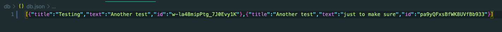
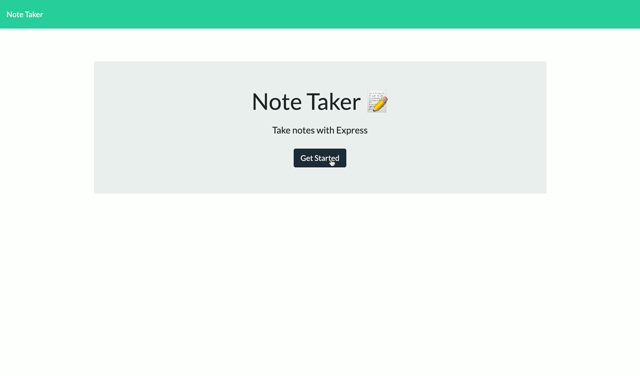

# Note-Taker

## Description

The purpose of this project is to create an application that allows the user to create and save notes, view previously saved notes, and delete previously saved notes.

## Table of Contents

* [Links](#links)

* [Usage](#usage)

* [Learning Outcomes](#learning-outcomes)

* [Conclusion](#conclusion)

## Links

* [GitHub Repo](https://github.com/elizabethbrandt/Note-Taker)

* [Deployed Heroku Site](https://eb-note-taker.herokuapp.com/)

## Usage

* This application is usable through Heroku and allows a user to write, keep, review, and delete notes.

Below is a screenshot that displays the notes as entered in on the app by the user

And then how they are entered in on the db.json file that the application reads to display the data, along with it's unique ID that's used to identify it in order to delete it.

## Learning Outcomes

#### The differences between the page and the api routes

* This was probably the biggest things I learned with this project as I was previously struggling to understand why there was a need for both and how they were different. What I learned was that the API route is what is managing the JSON data and conrolling what information is pushed to the `.json` file. Then the code defined within that `.get` for that specific `/route` controls what is displayed on the page.

#### Nanoid

* I was really happy to discover this as something available in `npm` instead of having to spend time building code to create unique IDs. Learning to use the resources available to you is a skill I'm learning to develop.

## Screenshots of deployed site

Video showing all the functionality of the application

## Conclusion

In conclusion, the server piece of this was not complicated. It's basically copying and pasting the basic format to make it run. Of course, you have to have all the right pieces, but it's pretty straightforward. Making the post work correctly was a bit of a challenge, but overall, once you understand how to use the fs modules and reading and writing files, it works pretty well.